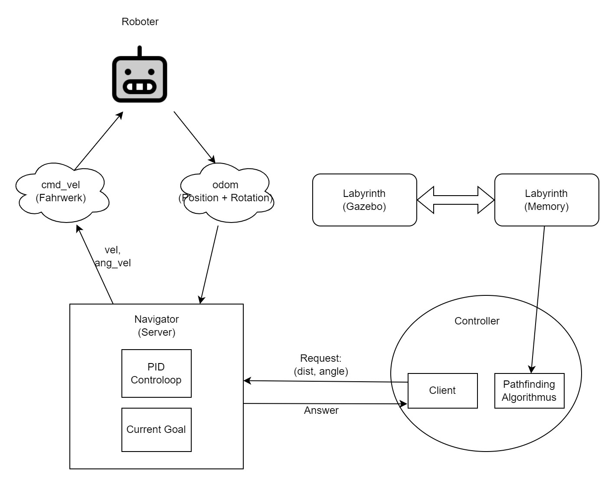

# AMPER: Autonomous Maze Pathfinding and Exploration Robot
AMPER is a robot project in ROS. The robot can navigate mazes by first finding a path for a given hardcoded labyrinth, then traverse the path from its start position to the target position.

## Setup
```sh
chmod u+x run.sh
chmod u+x generate_and_run.sh
source devel/setup.bash
```
## How to run
### Monte Carlo Simulation
It creates a new random labyrinth, sets a random start and end position, and runs the robot to solve the maze. You can set the
size of the maze with width and height arguments and with an optional minimum distance between the start and end positions (it defaults to 5). 
Because the minimum distance is 5, please set the width and height to at least 10.
```sh  
./generate_and_run.sh <width> <height> (min_diff)
```
### Generate random maze and set your own start and end positions
Generate a random maze with the given width and height, look at const_labyrinth.hpp in src/AMPER/src/controller then set the start and end positions to the given coordinates.
```sh
python3 src/AMPER/scripts/world_generation.py <width> <height>
catkin_make
./run.sh <start_x> <start_y> <end_x> <end_y>
```

## How it works
### Maze Generation
For the maze generation, we used Prim's algorithm.
1. Initialize a grid where all cells are considered as walls.
2. Select a single cell to be the current cell and mark it as part of the maze.
3. Add the walls of the current cell to a list of walls.
4. Enter a loop that continues as long as there are walls in the list.
5. Select a random wall from the list.
6. Check the cell on the opposite side of the selected wall. If it's not part of the maze yet:
   - Remove the selected wall.
   - Mark the cell on the opposite side as part of the maze.
   - Add the walls of the cell on the opposite side to the wall list.
7. Repeat the loop (go to step 5) until there are no more walls in the list.
8. After the loop ends, add walls around the entire perimeter of the maze to prevent the robot from going out of bounds.

The implementation was done in Python under scr/AMPER/scripts/maze_gen.py.
### Pathfinding
For the pathfinding, we used the A* algorithm. A* is a graph traversal and path search algorithm that finds the shortest path between the start node and the end node. 
It uses a heuristic function to estimate the cost of the cheapest path through a node. 

Implementation can be found in src/AMPER/src/controller/pathfinding.cpp.

### Robot Movement
For the movement we make use of ROS services.


### Summary



Implementation can be found in src/AMPER/src/controller/robot_controller.cpp and src/AMPER/src/navigation/navigator.cpp.